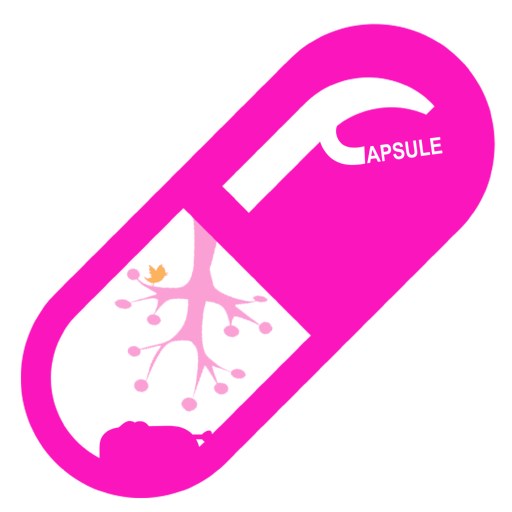

  

XML Parser for capsule gogue plugin.

  
  
  

# GOGUE Transpiler | Capsule

  __
  Transpile a capsule (.cap) file to covert it
  into a pure php file for the V feature of the 
  application flux.

## Todos 

  - 

### 21/06/2020 22:06
  - Decode whole the do blocks in the code include the nesteds
  - Decode blocks for array and php blocks {}
  - Read whole the interpolations and symbols

## Flux
  - 

## MVP
  - 
